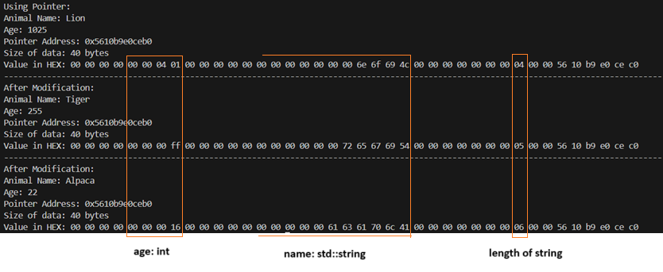
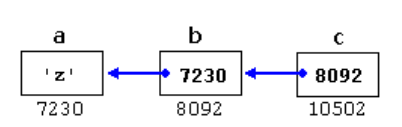
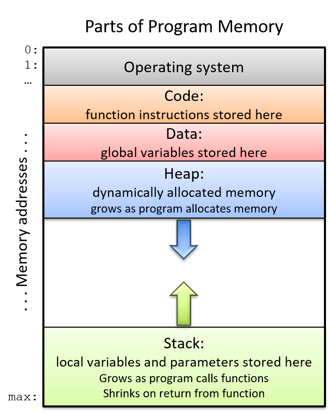

[YouTube tutorial Pointers](https://www.youtube.com/watch?v=zuegQmMdy8M&t=413s)

## Usage
Try to solve each problem by reading the problem and the output. If you are stuck you can see the code. Note that the adresses that are shown in ouput will be different and different each time you run the code.
### 0. Basics
This is not a problem but see the code read the comments and run it.

In C/C++, an `int` is a primitive data type. Primitives are stored directly in memory. Each piece of data resides in a specific memory block, and these blocks have "memory addresses" that uniquely identify them.

**Memory Allocation and Addresses**

When you declare `int i = 1;`, your computer:

1.  Allocates a block of memory suitable for storing an integer.
2.  Assigns a unique memory address to this block (e.g., `0xF00000`).
3.  Stores the value `1` in that memory location.

When you use the variable `i`, you're essentially accessing the value stored at the memory address `0xF00000`, which is `1`.

**The Address-of Operator (`&`)**

In C, you can obtain the memory address where a variable is stored using the ampersand (`&`) operator.

* `i === 1;`  // True: `i` holds the value 1.
* `&i === 1;` // False: `&i` is a memory address, not the value 1.
* `&i === 0xF00000;` // True (assuming `i` is stored at `0xF00000`).

**Pointers**

A pointer is a variable that stores a memory address. It "points" to a specific location in memory. Pointers themselves don't hold values in the same way primitives do; they hold memory addresses.

**Dereferencing Pointers (`*`)**

To access the value stored at the memory address held by a pointer, you use the dereference operator (`*`).

```c
int i = 1;      // Allocates an integer and assigns it the value 1.
int *ptr = &i;  // Creates a pointer 'ptr' that stores the memory address of 'i'.

printf("%d", i);   // Prints the value of 'i' (1).
printf("%d", *ptr); // Prints the value at the memory address stored in 'ptr' (also 1).
```
[Code](basics.cpp)
### 1. Print a pointer
Accept a integer argument as command line and prints:
- The memory address of the integer.
- The size of data in bytes.
- The values in hex.
- The values in bits.

[Code](pointer_print.cpp)\
Compilation
```
g++ -o bin/pointer_print.o pointers/pointer_print.cpp
./bin/pointer_print.o 1025
```
Output
```
Pointer Address: 0x7ffe7ed1689c
Size of data: 4 bytes
Value in HEX: 00 00 04 01 
Value in BITS: 00000000 00000000 00000100 00000001
```

### 2. Pointer of user defined class
Create a simple animal class with 2 member variable.
- `name` (std::string): Represents the name of the animal.
- `age` (int): Represents the age of the animal.

[Code](pointer_class.cpp)\
Output



### 3. Pointer arithmetic
Using the same animal class. Create array of 3 animals.
Using pointer arithmetic display the address and details of pointer.

[Code](pointer_arithmetic.cpp)\
Output
```
Size of data: 40 bytes
Pointer Address: 0x7ffe939563a0
Animal Name: Lion
Age: 5
Pointer Address: 0x7ffe939563c8
Animal Name: Tiger
Age: 4
Pointer Address: 0x7ffe939563f0
Animal Name: Elephant
Age: 10
```
Note:\
0x7ffe939563c8 - 0x7ffe939563c8 = 0x000000000028 (in hex) = 40 in decimal\
When creating an array the memory for individual variable/object are consequent. Thus my incrementing the pointer value we can get to the next variable/object.

### 4. Void pointer
Go through the [code](void_pointer.cpp) and read the comments.

### 5. Pointer to Pointer
[Resource](https://home.csulb.edu/~pnguyen/cecs282/lecnotes/Pointer%20to%20Pointer.pdf)

Pointer to a pointer is a form of multiple indirection or a chain of pointers.
Normally, a pointer contains the address of a variable. When we define a
pointer to a pointer, the first pointer contains the address of the second
pointer, which points to the location that contains the actual value as shown
below.

A variable that is a pointer to a pointer must be declared as such. This is done
by placing an additional asterisk in front of its name. For example, following
is the declaration to declare a pointer to a pointer of type int −
`int **var;`
When a target value is indirectly pointed to by a pointer to a pointer,
accessing that value requires that the asterisk operator be applied twice, as
is shown below in the example −

```c
#include <iostream>
using namespace std;
int main () {
 int var;
 int *ptr;
 int **pptr;
 var = 3000;
 // take the address of var
 ptr = &var;
 // take the address of ptr using address of operator &
 pptr = &ptr;
 // take the value using pptr
 cout << "Value of var :" << var << endl;
 cout << "Value available at *ptr :" << *ptr << endl;
 cout << "Value available at **pptr :" << **pptr << endl;
 return 0;
}

```
Output
```
Value of var :3000
Value available at *ptr :3000
Value available at **pptr :3000
```
C++ allows the use of pointers that point to pointers, that these, in its turn,
point to data (or even to other pointers). The syntax simply requires an
asterisk (*) for each level of indirection in the declaration of the pointer:
```c
char a;
char * b;
char ** c;
a = 'z';
b = &a;
c = &b;
```
This, assuming the randomly chosen memory locations for each variable
of 7230, 8092, and 10502, could be represented as:



See this [code](pointer_to_pointer.cpp) and read the comments.

Output:
```
x = 5
x = 10
Address of x = 0x7fffbf775edc, value of x = 10
Address of p = 0x7fffbf775ee0, value of p = -1082695972
Address of pp = 0x7fffbf775ee8, value of pp = -1082695968
Dereferencing of p = 10
Dereferencing of pp one time = -1082695972, two time = 10
Dereferencing of ppp one time = -1082695968, two time = -1082695972, three time = 10
```
### 6. Pointers as function arguments - Call by reference



